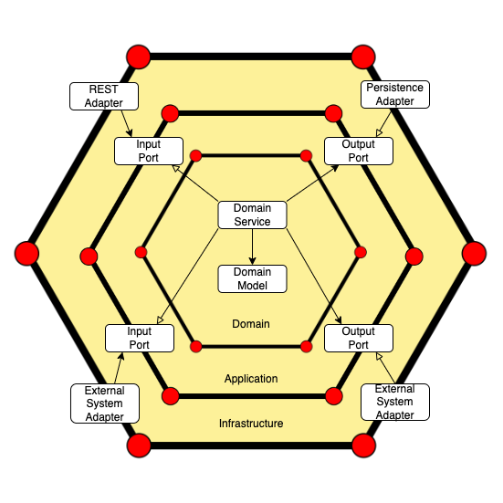

# PoC - Hexagonal Architecture and Domain Driven Design with Spring Boot 3

<!-- TOC -->
* [PoC - Hexagonal Architecture and Domain Driven Design with Spring Boot 3](#poc---hexagonal-architecture-and-domain-driven-design-with-spring-boot-3)
    * [Exemplo](#exemplo)
    * [Aplicativo](#aplicativo)
    * [A infraestrutura](#a-infraestrutura)
    * [Domínio](#domínio)
    * [Tecnologias](#tecnologias)
<!-- TOC -->

A principal ideia por trás dessa arquitetura é isolar a lógica de domínio de componentes externos ao projetar aplicativos de software.

O acesso externo à lógica do domínio está disponível por meio de portas e adaptadores.

Uma porta é apenas uma interface a ser implementada por um adaptador. Existem dois tipos de portas: entrada e saída. Implementamos os primeiros na camada de domínio, enquanto o módulo de infraestrutura conterá a implementação dos segundos.

## Exemplo

Vamos considerar um serviço REST de produto simples para entender essa arquitetura. Os recursos do produto serviço são:

Criar um Produto Obter o Produto por Id

Começamos criando as três camadas: aplicativo, infraestrutura e domínio.

## Aplicativo

A camada de aplicação conterá as portas, que são interfaces que permitem o fluxo de entrada ou saída.

Criamos casos de uso dentro do pacote de entrada, definindo o que o usuário gostaria de fazer na aplicação. Em nosso exemplo, crie novos produtos e obtenha-os por Id.

Por outro lado, usamos o pacote de saída para conectar alguns componentes externos. Em nosso exemplo, ProductOutputPort obterá dados do banco de dados.

## A infraestrutura

A camada de infraestrutura representa a parte externa da arquitetura hexagonal por meio de adaptadores.

Os adaptadores interagem com o aplicativo principal apenas usando as portas de entrada e saída.

Dividimos o pacote Infrastructure.adapters em três novos:

- config: contém os beans da aplicação
- input: conduz o aplicativo invocando o caso de uso correspondente (porta de entrada)
- saída: fornece uma implementação das portas de saída (bancos de dados ou filas de mensagens)

## Domínio

A camada de domínio é o centro do sistema. Ele lida com a lógica de negócios e representa o núcleo do aplicativo.

A camada de domínio é totalmente dissociada das camadas de aplicativo e infraestrutura, portanto, as alterações nas outras camadas não têm impacto no objeto de domínio Produto, a menos que haja uma alteração nos requisitos de negócios.

O ProductService é um componente crucial dentro do domínio, pois implementa as portas de entrada e usa as interfaces de saída implementadas pelos adaptadores de saída para retornar o resultado aos adaptadores de entrada.

## Tecnologias

- Java 20
- Spring Boot 3
  - Spring Data JPA
  - Spring Web
  - Spring Devtools
  - Model Mapper
  - Loombok
- PostegreSQL 12
- Docker Compose